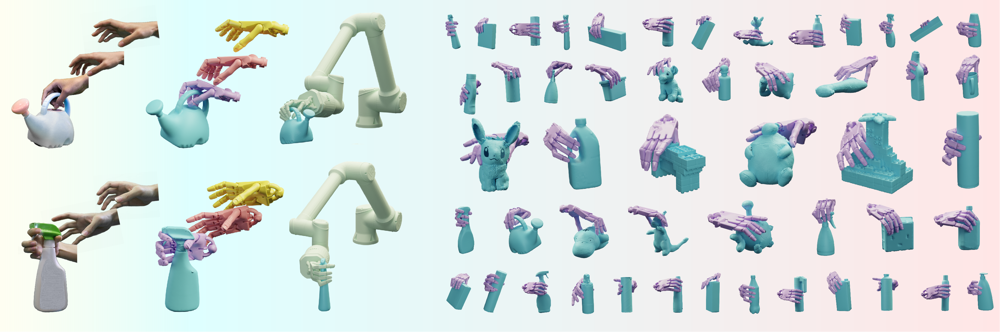

# RealDex
This repository is for RealDex dataset and the code for IJCAI 2024 paper [RealDex: Towards Human-like Grasping for Robotic Dexterous Hand](https://4dvlab.github.io/RealDex_page/)


## Dataset
```
pip install gdown
pip install requests
```
Before download, first check the availability of the download links:
```
python download/download_dataset.py --test
```
If all links are available:
```
python download/download_dataset.py --dest_folder /path/to/destination/folder
```

## Installation

## data preprocess
Generate point clouds from RGBD images
```bash
cd ./data_preprocess
python gen_pcd.py
```

